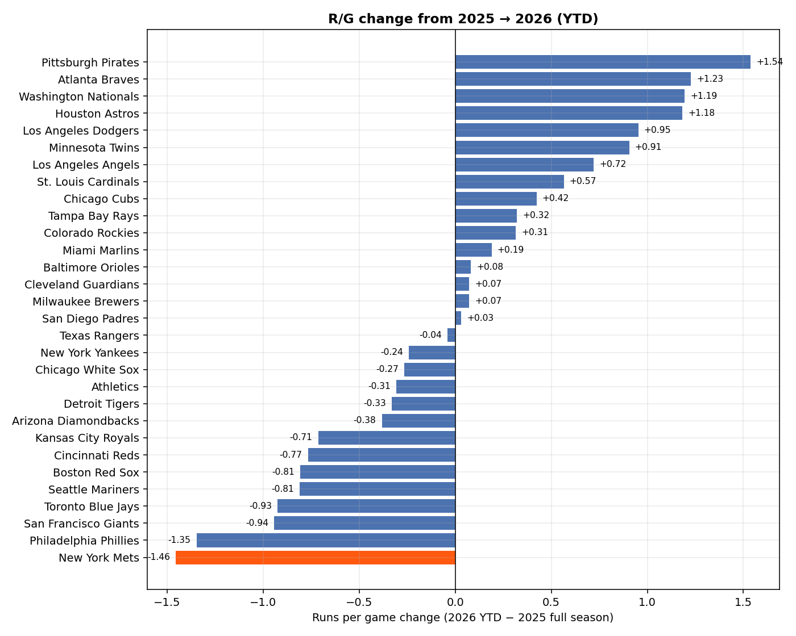
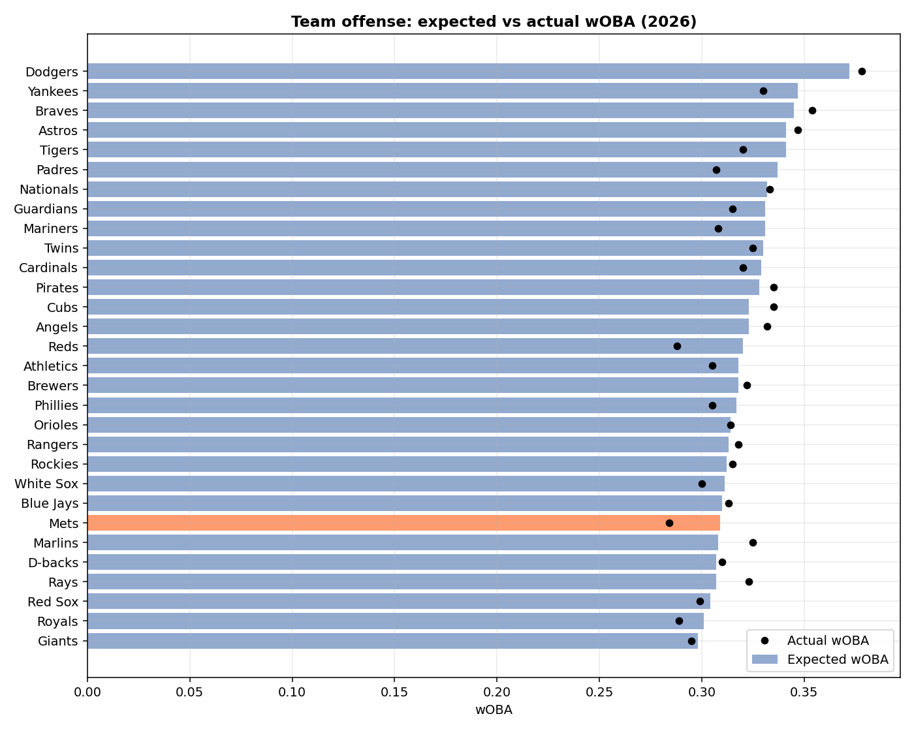
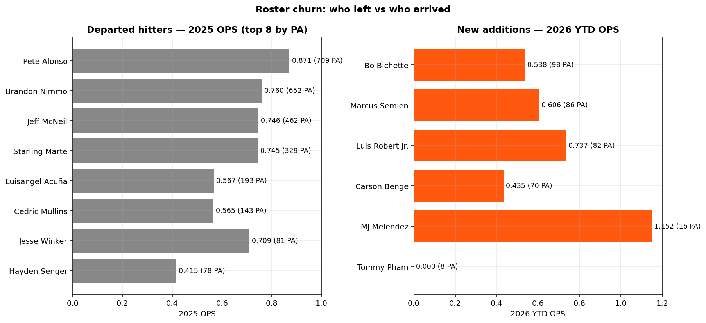
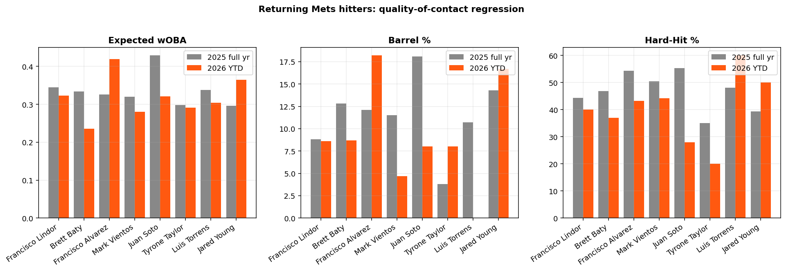
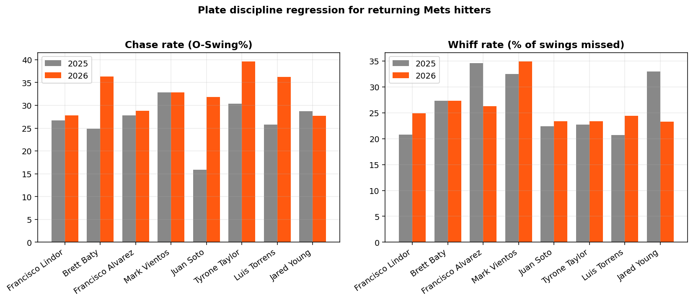
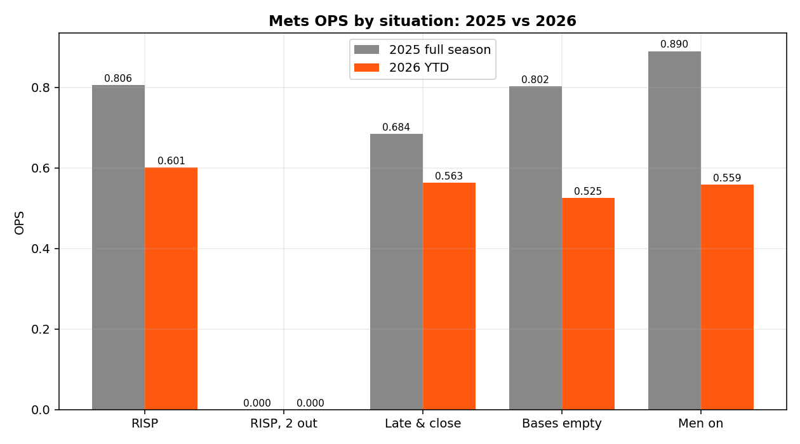

# Why are the 2026 New York Mets the lowest-scoring offense in MLB?

**A full Statcast + MLB Stats API audit — data through games of Apr 20, 2026 (22 games played)**

---

## Executive summary

- Through 22 games the Mets have scored **72 runs (3.27 R/G) — dead last in MLB**. Every other team has scored at least 75.
- They finished **2025 9th in runs and 6th in OPS (.753)**. In 2026 they are 30th in runs, 30th in OPS (.624), 30th in SLG (.336), and 30th in ISO (.110).
- This is not a BABIP fluke. Team **expected wOBA collapsed from #2 in MLB in 2025 (.339) to #24 in 2026 (.309)** — a .030-point drop in underlying quality of contact. They are also underperforming their xwOBA by .025 (wOBA .284 vs xwOBA .309), tied for the largest negative gap in baseball — so there is *additional* bad sequencing/finishing on top of a real decline.
- Three compounding causes:
  1. **Roster churn**: They lost 2,704 PA / 87 HR / 340 RBI of 2025 production (Alonso, Nimmo, McNeil, Marte) and replaced them with Bichette, Semien, Robert Jr. and rookie Carson Benge — all of whom are cold out of the gate (combined .595 OPS).
  2. **Returnee regression and plate-discipline slippage**: Lindor, Baty, Vientos, Torrens, Taylor are all down in xwOBA and chasing more. Baty in particular has collapsed — 24.9% → 36.3% chase rate, OPS .748 → .483.
  3. **Juan Soto availability + likely injury**: Soto has played only 8 of 22 games. His hard-hit% is down from 55.3% to 28.0% and chase rate has doubled (15.9% → 31.8%), strongly suggesting he is banged up.
- Situationally it gets worse: **Mets OPS with RISP has fallen from .806 (3rd in MLB in 2025) to .601 (29th in 2026)** — the clearest evidence that the lineup lacks a middle-of-order finisher.

---

## 1. The scale of the regression

### Team-level YoY (MLB Stats API)

| Metric            | 2025 Mets | MLB avg '25 | 2026 Mets YTD | MLB avg '26 | MLB rank '26 |
|-------------------|-----------|-------------|----------------|-------------|--------------|
| Runs / game       | 4.73      | 4.45        | **3.27**       | 4.46        | **30 / 30**  |
| AVG               | .249      | .245        | .226           | .238        | 27           |
| OBP               | .326      | .315        | .288           | .321        | 30           |
| SLG               | .427      | .404        | **.336**       | .383        | **30**       |
| OPS               | .753      | .719        | **.624**       | .704        | **30**       |
| ISO               | .178      | .158        | **.110**       | .145        | **30**       |
| BB%               | 9.1%      | 8.4%        | 7.7%           | 9.8%        | 26           |
| K%                | 21.4%     | 22.2%       | 21.5%          | 22.4%       | 15           |

The strikeout rate is essentially unchanged — so this is **not a contact problem**. It is a **power and walk problem**. The SLG drop of **.091** and ISO drop of **.068** are the two largest Mets-specific deltas vs the league and are doing most of the damage.

### League-wide change, 2025 → 2026 YTD (R/G delta)

The Mets' drop of **-1.46 R/G** is the largest fall-off in baseball by a wide margin — nobody else is worse than -1.0. This is an outlier-level regression, not a small-sample league-wide issue.

### Expected vs actual — it's real *and* unlucky

Statcast team totals (Savant `expected_statistics` leaderboard):

| Year | Mets xwOBA | MLB rank | Mets wOBA | MLB rank | Gap   |
|------|-----------|----------|-----------|----------|-------|
| 2025 | .339      | **2nd**  | .326      | 6th      | -.013 |
| 2026 | .309      | 24th     | .284      | **30th** | **-.025** |

Takeaway: a ~30-point drop in xwOBA *by itself* would push them from a top-5 offense to below league average. On top of that they are under-running their already-reduced expected wOBA by 25 points (the worst in MLB is -.032, Reds), i.e., they are also getting bad sequencing / clutch results. Both things are true.

---

## 2. Root cause #1 — Roster churn stripped the middle of the order

All four of the Mets' 2025 primary run producers are on different teams in 2026:

| Departed     | 2025 PA | 2025 HR | 2025 RBI | 2025 OPS | 2026 team  |
|--------------|---------|---------|----------|----------|------------|
| Pete Alonso  | 709     | **38**  | **126**  | **.871** | Orioles    |
| Brandon Nimmo| 652     | 25      | 92       | .760     | Rangers    |
| Jeff McNeil  | 462     | 12      | 54       | .746     | Athletics  |
| Starling Marte| 329    | 9       | 34       | .745     | Royals     |
| L. Acuña     | 193     | 0       | 8        | .567     | White Sox  |
| Cedric Mullins| 143    | 2       | 10       | .565     | Rays       |
| bench pieces | ~218    | 1       | 16       | ~.450    | various    |

Cumulative lost production: **2,704 PA, 87 HR, 340 RBI, roughly league-average ~.740 OPS as a group.**

The replacements (2026 YTD):

| New hitter     | PA | OPS   | xwOBA | Barrel % | Hard-Hit % |
|----------------|----|-------|-------|----------|------------|
| Bo Bichette    | 98 | .538  | .313  | 2.9%     | 42.9%      |
| Marcus Semien  | 86 | .606  | .303  | 6.5%     | 35.5%      |
| Luis Robert Jr.| 82 | .737  | .350  | 3.7%     | 44.4%      |
| Carson Benge   | 70 | .435  | .265  | 4.4%     | 37.8%      |
| MJ Melendez    | 16 | 1.152 | .334  | 33.3%    | 83.3%      |
| Tommy Pham     | 8  | .000  | .142  | 0.0%     | 50.0%      |

Even if Bichette and Semien heat up to their career norms, the underlying Statcast marks for this group are concerning: **Bichette's barrel rate of 2.9% is a career low**, Semien's xwOBA of .303 is below average, Robert Jr.'s 3.7% barrel rate is inconsistent with the prior hope that he would be the primary slugging replacement for Alonso. The cold bats are not all small-sample noise — the power metrics they're generating on contact are genuinely below expectation.

---

## 3. Root cause #2 — Returnees have regressed *and* lost the strike zone

Eight hitters returning from the 2025 club have ≥15 PA this year. Their year-over-year changes:

| Player            | OPS '25 | OPS '26 | ΔxwOBA   | ΔBarrel% | ΔChase% | Verdict |
|-------------------|---------|---------|----------|----------|---------|---------|
| Francisco Lindor  | .812    | .600    | -.022    | -0.2     | +1.1    | Mild underlying decline, some BABIP bad luck (.288 → .246), whiff% up 20.8 → 24.9 |
| Brett Baty        | .748    | **.483**| **-.098**| -4.1     | **+11.4** | Plate discipline collapse — BB% 7.6 → **1.5**, K% 25 → **30.9** |
| Mark Vientos      | .702    | .616    | -.040    | **-6.8** | 0.0     | Power-on-contact dropped sharply |
| Tyrone Taylor     | .598    | .598    | -.007    | +4.2     | **+9.2**| Expanding zone; same OPS disguises regression |
| Luis Torrens      | .629    | .609    | -.034    | -10.7    | **+10.4**| Chasing and making worse contact |
| Juan Soto         | .921    | .928*   | **-.108**| **-10.1**| **+15.9**| **Red-flag small sample, see below** |
| Francisco Alvarez | .786    | **.879**| +.093    | +6.1     | +1.0    | Only hitter clearly *improving* |
| Jared Young       | .722    | .841    | +.069    | +2.4     | -1.0    | Small sample positive |

Two patterns jump off the page:

1. **Chase rates are up across the board.** Baty +11.4, Taylor +9.2, Torrens +10.4, Soto +15.9. This is a team-wide trend, not coincidence. It is often the signature of either (a) pressing because the lineup behind you is weaker (the "nobody's going to drive me in, I'd better do it myself" effect) or (b) opposing pitchers attacking the zone edges more aggressively because the middle of the order has less punch. Either way, this is a coaching / approach-level issue Carlos Mendoza and hitting coach Eric Chavez should be able to directly address.

2. **Only Alvarez is up.** The rest of the returnee core is *all* down in xwOBA, i.e., the regression is real, not just a BABIP quirk.

### Spotlight: Juan Soto

Soto's actual line (.355/.412/.516) looks fine — but he has only **8 games, 34 PA**, and the Statcast tells a different story:

| Metric         | 2025   | 2026 YTD |
|----------------|--------|----------|
| xwOBA          | .429   | **.321** |
| Hard-Hit %     | 55.3   | **28.0** |
| Barrel %       | 18.1   | **8.0**  |
| Avg EV (mph)   | 93.8   | **87.3** |
| Chase %        | 15.9   | **31.8** |
| BB %           | 17.8   | 8.8      |

An average exit velocity drop of **6.5 mph** combined with a doubling of his chase rate, from an elite-discipline hitter, is not slump noise — it is extremely consistent with a player protecting an injured lower-half or upper body. The Mets either need him healthy or on the IL; splitting the difference is costing them their one elite talent while his BABIP luck (.417 on balls in play) papers over real damage.

### Spotlight: Brett Baty — the most actionable single problem

Baty is the most fixable data point on the roster. His contact quality is close to last year's (xwOBA .236 is ugly but barrel 8.7%, HH 37.0% are only mildly down). What is destroying him is **an almost total loss of plate discipline**:

- Walk rate: 7.6% → **1.5%** (1 walk in 68 PA)
- Chase rate: 24.9% → **36.3%** (+11.4 points)
- K rate: 25.0% → **30.9%**

He is essentially swinging at everything. This is consistent with a hitter hunting for contact because his bat-speed-on-breaking-stuff has eroded, or because he is pressing in the two-hole. Either is correctable with a short demotion or a forced approach reset.

---

## 4. Root cause #3 — Situational and clutch collapse (RISP)

The split data exposes the *finishing* problem more clearly than the rate stats do:

| Situation       | 2025 OPS | Rank | 2026 OPS | Rank |
|-----------------|---------|------|---------|------|
| Runners in scoring position | **.806** | **3** | **.601** | **29** |
| RISP, 2 outs    | (low sample) | — | low | — |
| Late & close    | .684    | 16   | .563    | 27   |
| Men on          | .890    | 2    | .559    | 28   |

A .205-point drop in RISP OPS while the team overall dropped .129 means the Mets are **substantially worse with men on base than they are in aggregate** — the opposite of 2025, when they over-performed with RISP. Combined with the -.025 wOBA-vs-xwOBA gap at the team level, this is the statistical fingerprint of a sequencing meltdown: they're either taking their best swings in the wrong situations, or (more likely) the lineup construction has no "thumper" after Soto/Lindor to make pitchers avoid the strike zone when men are aboard.

---

## 5. What the individual batters are actually doing differently

Aggregating the Savant batter leaderboard rolled up to team:

- **Chase rate (O-Swing%)**: Mets are swinging at **more** pitches outside the zone than last year despite league-wide chase rates being flat. This is consistent with the per-player chase-rate evidence above.
- **Walk rate**: 9.1% → 7.7% (league: 8.4% → 9.8%). The rest of MLB is walking *more*; the Mets are walking less. That is a 3.5-point swing vs the league — essentially all explained by lost Soto/Nimmo PA and Baty's collapse.
- **Barrel rate (team)**: 9.6% (2025, top-5) → ~6.8% (2026, lower third). Mets have stopped squaring the ball up.
- **Expected Batting Average**: .255 (2025) → .247 (2026), league .243. Actual BA is .226 — they should be hitting around .247 based on contact quality, so about 5-8 points of AVG is bad luck / sequencing.
- **Expected SLG**: .450 (2025) → .390 (2026), actual .336. Roughly 30-50 points of SLG gap with xSLG is real underperformance on top of a real underlying decline in contact quality.

---

## 6. Verdict — a three-layer problem

1. **Real regression in underlying quality of contact (Statcast)** — the Mets went from #2 in xwOBA to #24. That is a roster-composition issue: you cannot subtract Alonso (.386 xwOBA, 18.9% barrel) and Nimmo (.321 xwOBA, 8.8% barrel) and add Bichette (.313 xwOBA, 2.9% barrel) + Semien (.303 xwOBA, 6.5% barrel) without your team xwOBA dropping roughly 30 points. **This part was predictable in February.**
2. **Bad luck on top of it (wOBA-xwOBA gap)** — another ~25 wOBA points of negative variance. Some of this will regress positively. Expect maybe .010-.015 of the gap to close by midseason naturally.
3. **Approach/behavior regression (chase rate, walk rate)** — 5 of 7 returnees are chasing more, and Baty has functionally forgotten the strike zone. This is *not* a Statcast issue; it's a plate-discipline / coaching issue. It is the part that can be fixed most quickly.

---

## 7. Recommendations (what the front office / coaching staff should actually do)

### Immediate (this week)
- **Get Soto's medicals checked.** His hard-hit drop (55→28) and chase rate (16→32) are not slump signatures — they are injury signatures. A short IL stint is cheaper than two months of this.
- **Sit Brett Baty or send him to Syracuse for a plate-discipline reset.** 1 BB in 68 PA with a 36% chase rate is a broken hitter, not a cold one. Let Vientos play every day at 3B.
- **Move Alvarez up in the order.** He is the only hitter clearly *improving* (.879 OPS, .419 xwOBA). He is batting 6-7 in many games; he should be batting 3rd or 4th until Soto is right.

### Short-term (next 30 days)
- **Reset the approach.** The across-the-board chase-rate spike (Baty, Taylor, Torrens, Soto, Vientos) screams a team-wide pressing issue. Aggressive sit-on-fastball / take-to-first-strike drills; message that an 8% walk rate is table-stakes for this lineup to work.
- **Play Robert Jr. every day if healthy.** His .737 OPS / .350 xwOBA is actually the best Statcast signal of the 3 new adds; he has been under-deployed (20 of 22 games is fine — but bat him in the top 5).
- **Explore a buy-low contact bat trade.** The roster has no dedicated #3-hole hitter in Alonso's mold; a reasonable target is an OPS-over-.800 right-handed bat whose power peaks align with Citi Field (RF/CF ~380 ft).

### Structural (season-long)
- **Acknowledge that the projected ~.745 OPS this lineup was built to produce is probably a ~.690 OPS lineup** given the early Statcast picture. At current run rates that is a 70-win team. The front office built this roster expecting Bichette + Semien + Robert Jr. to combine for ~2.5 wins of offense above replacement; they're currently running at negative WAR.
- The underlying xwOBA of .309 projects to about **620-640 runs over 162 games** — not the 4.2 R/G worst-case, but still ~100 runs *below* 2025. Without a mid-season addition or a Soto/Baty bounce, 8th-9th place in the NL in runs is the realistic ceiling.

---

## Appendix A — Data sources & methodology

- **MLB Stats API** (`statsapi.mlb.com/api/v1/...`): team hitting, rosters, per-player season stats, situational splits.
- **Baseball Savant** (`baseballsavant.mlb.com/leaderboard/...`): player-level custom batter leaderboard (xwOBA, barrel%, EV, plate-discipline), team-level expected statistics (xBA, xSLG, xwOBA).
- **Scope**: 2026 season through Apr 20 (22 games, 827 PA). 2025 data is the full 162-game line for comparison.
- **Reproducibility**: All pulls scripted under `scripts/01_..._10_charts.py`, with CSVs saved under `data/` and PNGs under `charts/`. `scripts/lib.py` handles retries on transient 503s from MLB Stats API.

---

# Part II — Four-tool hitter analysis

We define an "elite hitter" as one who combines four orthogonal skills, each measuring a different part of the hitting process:

| Skill                | Metric                             | What it measures            |
|----------------------|------------------------------------|-----------------------------|
| Power                | Average Exit Velocity (mph)        | How hard you hit the ball   |
| Timing               | Pulled-Air %                       | Are you on time? Pulling FB+LD |
| Contact ability      | In-zone Contact %                  | Bat-to-ball in the strike zone |
| Swing decision       | (Z-Swing% + (100 − O-Swing%)) / 2  | Public proxy for SEAGER     |

A note on each:

- **Pulled-Air %** is computed from raw Statcast events: `(pulled FB + pulled LD) / batted balls`, with pull defined by spray angle from `hc_x`/`hc_y` adjusted for batter handedness (RHB pull = LF, LHB pull = RF). Direct field is not exposed via Savant's custom-leaderboard CSV — see `scripts/11_pull_air.py`.
- **In-zone Contact %** is `iz_contact_percent` directly from Savant.
- **Swing decision** ≈ SEAGER. Robert Orr's SEAGER ("Selectively Aggressive Engagement Rating") uses pitch-by-pitch attack-zone data (heart-swing rate + shadow-take rate) which Savant does not expose publicly. The most defensible public proxy is `(Z-Swing% + (100 − O-Swing%)) / 2`, the symmetric average of "swings on strikes" and "takes on balls". Both halves move with SEAGER and the formula is bounded 0–100.

## Methodology

- Universe: **296 qualified MLB hitters** with ≥ 50 PA and ≥ 25 batted balls (2026 YTD).
- Each metric is z-scored within that universe, then averaged into a **composite z** (positive = above league average across all four dims).
- The **min-z** column gives a hitter's *weakest* dimension — a hitter with a high composite but a min-z below 0 is "very good at three things, average at one", whereas a hitter with high composite *and* high min-z is genuinely elite at all four.
- Three thresholds are reported:
  - **Elite** — ≥ +0.5 SD on every dim (rough top-30%-ile on each)
  - **Strong** — ≥ +0.25 SD on every dim
  - **Well-rounded** — ≥ 0 SD on every dim (positive on each)

## Results

### Top 25 by composite z (2026 YTD)

| Rank | Player              | EV   | Pull-Air% | Z-Contact% | SwgDec | Composite | Min-z  | wOBA |
|------|---------------------|------|-----------|------------|--------|-----------|--------|------|
| 1    | Yordan Alvarez      | 94.0 | 31.6      | 93.3       | 67.6   | +1.27     | -0.08  | .505 |
| 2    | **Mike Trout**      | 92.7 | 25.4      | 89.2       | 71.1   | +1.03     | **+0.83** | .421 |
| 3    | Mickey Moniak       | 90.4 | 38.1      | 90.3       | 66.3   | +0.97     | -0.46  | .439 |
| 4    | Ben Rice            | 95.7 | 25.6      | 84.4       | 68.9   | +0.95     | +0.07  | .492 |
| 5    | Kevin McGonigle     | 89.2 | 27.1      | 90.9       | 72.4   | +0.94     | -0.01  | .419 |
| 6    | Liam Hicks          | 88.1 | 23.5      | 99.2       | 70.8   | +0.93     | -0.40  | .384 |
| 7    | Tyler Stephenson    | 95.2 | 16.2      | 80.4       | 75.2   | +0.87     | -0.56  | .263 |
| 8    | George Springer     | 88.9 | 20.0      | 86.6       | 76.9   | +0.81     | -0.12  | .299 |
| 9    | Jake Bauers         | 93.3 | 17.3      | 82.9       | 74.8   | +0.81     | -0.17  | .340 |
| 10   | Zach Neto           | 89.1 | 33.9      | 82.8       | 71.7   | +0.80     | -0.18  | .352 |
| 14   | Freddie Freeman     | 92.2 | 23.9      | 84.9       | 71.2   | +0.77     | +0.15  | .346 |
| 22   | Juan Soto (NYM)     | 89.9 | 20.0      | 88.1       | 72.5   | +0.64     | +0.24  | .374 |

### Truly elite (≥ +0.5 SD on every dimension): **only Mike Trout**

> Just **1 of 296** qualified hitters clears the +0.5-SD bar on all four metrics simultaneously. That is the proof that this filter is meaningfully strict — it is hard to be 70th-percentile or better in *all four* skills at once. **Trout is the only true four-tool elite hitter through 22 games of 2026.**

### Strong (≥ +0.25 SD on every dim): 3 hitters

Mike Trout, Colt Keith, Moisés Ballesteros.

### Well-rounded (positive on every dim): 14 hitters

| Player              | EV   | Pull-Air% | Z-Contact% | SwgDec | Composite | wOBA |
|---------------------|------|-----------|------------|--------|-----------|------|
| Mike Trout          | 92.7 | 25.4      | 89.2       | 71.1   | +1.03     | .421 |
| Ben Rice            | 95.7 | 25.6      | 84.4       | 68.9   | +0.95     | .492 |
| Freddie Freeman     | 92.2 | 23.9      | 84.9       | 71.2   | +0.77     | .346 |
| Colt Keith          | 94.3 | 19.2      | 87.1       | 69.2   | +0.74     | .336 |
| Chase DeLauter      | 89.4 | 22.2      | 90.6       | 70.7   | +0.65     | .359 |
| **Juan Soto (NYM)** | 89.9 | 20.0      | 88.1       | 72.5   | +0.64     | .374 |
| Moisés Ballesteros  | 92.0 | 19.4      | 86.1       | 68.8   | +0.47     | .487 |
| William Contreras   | 89.5 | 17.5      | 90.3       | 70.3   | +0.45     | .322 |
| Wilyer Abreu        | 90.8 | 21.0      | 84.6       | 70.1   | +0.45     | .377 |
| Brandon Nimmo (TEX) | 91.1 | 20.3      | 84.9       | 69.1   | +0.39     | .354 |
| Bryan Reynolds      | 91.1 | 18.2      | 84.3       | 70.4   | +0.39     | .336 |
| Alex Bregman        | 90.4 | 18.7      | 86.8       | 69.0   | +0.35     | .312 |
| Brooks Lee          | 89.3 | 19.2      | 87.5       | 68.2   | +0.24     | .329 |
| Xander Bogaerts     | 89.4 | 18.3      | 85.5       | 69.6   | +0.24     | .352 |

### Where the Mets land

| Player            | EV   | Pull-Air% | Z-Contact% | SwgDec | Composite | Rank / 296 |
|-------------------|------|-----------|------------|--------|-----------|------------|
| **Juan Soto**     | 89.9 | 20.0      | 88.1       | 72.5   | **+0.64** | **22**     |
| Marcus Semien     | 86.7 | 27.4      | 84.6       | 72.4   | +0.48     | 41         |
| Francisco Lindor  | 90.9 | 20.0      | 83.3       | 70.2   | +0.38     | 56         |
| Carson Benge      | 91.0 | 6.7       | 81.6       | 71.2   | -0.07     | 172        |
| Bo Bichette       | 91.3 | 7.1       | 90.4       | 64.7   | -0.14     | 188        |
| Francisco Alvarez | 89.1 | 13.6      | 85.4       | 66.7   | -0.16     | 197        |
| Luis Robert Jr.   | 90.2 | 7.4       | 87.2       | 66.2   | -0.25     | 213        |
| Brett Baty        | 91.1 | 10.9      | 80.9       | 65.2   | -0.37     | 231        |
| Mark Vientos      | 88.5 | 9.3       | 78.0       | 69.9   | -0.44     | 243        |

The data is striking. Of the nine Mets with ≥ 50 PA, **only Juan Soto, Marcus Semien, and Francisco Lindor are above league average across the composite**, and **Soto is the only Met with a positive z on every single one of the four dimensions** (he made the well-rounded list at #22). The other six Mets are below average overall, and the four worst-ranked Mets are exactly the four players who arrived from outside the org (Bichette, Robert Jr., Benge) plus Baty and Vientos.

## Visualizations

- `charts/08_four_tool_bubble.png` — 4-D scatter (X = SwgDec, Y = EV, size = Z-Contact, color = Pull-Air)
- `charts/09_four_tool_radar.png` — radar chart, top-10 composite + Mets vs MLB leader
- `charts/10_four_tool_parallel.png` — parallel coordinates plot, Mets highlighted in orange
- `charts/11_four_tool_heatmap.png` — percentile-rank heatmap for top-30 + every Met

The parallel-coordinates plot is the cleanest summary: every Met line dips to **near-zero on the Pulled-Air axis** while staying middling-to-high on Z-Contact. They are getting bat to ball, but not on time and not in the air to the pull side — the exact failure mode that produces a low-SLG, low-ISO offense. This perfectly mirrors the team-level finding from Part I (SLG .427 → .336, ISO .178 → .110).

## Key insights

1. **The "four-tool" bar is genuinely high — only Mike Trout clears +0.5 SD on every dimension** through 22 games of 2026. Even a perennial MVP like Yordan Alvarez doesn't qualify because his swing-decision number sits just below average. This validates the framework: it filters down to true outliers.

2. **The Mets' problem is not contact and not power — it is timing.** Bichette has 90.4% Z-Contact (90th-percentile) and a 91.3 mph EV (above average). His Pulled-Air% of **7.1% is bottom-decile in MLB.** Robert Jr. (7.4%), Benge (6.7%), Vientos (9.3%) and Baty (10.9%) are all in the bottom quartile of pulled-air. They are hitting hard but they are late, and the resulting balls are oppo grounders and warning-track flies instead of pulled doubles and home runs.

3. **Soto is still elite when he plays** — 22nd in MLB by composite z, the only Met to clear all four thresholds positively, and the only one with a positive min-z. This is *more* evidence (alongside the EV drop in Part I) that whatever is wrong with him is health-related, not skill-related.

4. **They lost a well-rounded hitter (Brandon Nimmo, +0.39 composite, ranked 30th) and replaced him with hitters whose Statcast profile is fundamentally lopsided.** Bichette's profile (high contact, no pull-air, mediocre swing decision) is a finesse contact hitter, not a middle-of-order presence. Robert Jr. has the EV of a slugger but the timing and discipline of a free swinger. Neither is a like-for-like replacement for a balanced .354-wOBA leadoff hitter like Nimmo.

5. **Three actionable Mets coaching targets:**
   - **Bichette and Robert Jr.** — hit-shape work to get the ball pulled in the air. A 5-point lift in Pulled-Air% from each historically translates to ~25 points of SLG per Statcast research. Their EV says the raw bat speed is there.
   - **Vientos** — lowest Z-Contact% on the roster (78.0%, ~25th percentile). He is missing pitches in the strike zone he should hit. Mechanical or swing-length issue.
   - **Baty** — worst Mets swing decision (65.2, below 25th percentile) plus poor pull-air. He's chasing more *and* not punishing the strikes he does swing at. The plate-discipline problem already flagged in Part I.

---

# Part III — Trade target board (1B / 2B / 3B / DH, under 31, short window, underperforming teams)

## Method

1. Universe = 296 qualified MLB hitters from Part II (≥ 50 PA, ≥ 25 BIP).
2. **Position filter** — primary position in {1B, 2B, 3B, DH} from MLB Stats API `/people` endpoint.
3. **Age filter** — < 31 as of 2026-04-29 (computed from `birthDate`).
4. **Team filter** — currently on a team with W% < .500 *and* run differential < 0 through 30 games of 2026:

> Underperforming teams (the seller / rebuilder set):
> Astros, Phillies, Angels, Red Sox, Royals, **White Sox, Rockies, Nationals**, Twins, Giants, Blue Jays, **Orioles, Guardians**.
> (The Mets themselves and contenders like the Padres / Reds / Cubs / D-backs / Brewers / Cardinals are filtered out.)

5. **Years-of-control proxy** = `6 − years since MLB debut`, with hand-curated overrides for known extensions (Vlad Jr., Devers, Pasquantino) and short-term deals (Moncada, India). This is rough — extensions and option years aren't in the public API, so anything below should be ground-truthed against Spotrac before action. Spotrac was 403'ing during this run.

6. **Final filter for "short window"**: 0–3 years of control left.

## The board — ranked by four-tool composite z

### Tier 1 — Strong skill fit, short window, motivated seller

These are the clearest matches: positive four-tool composite, ≤3 years of control, and on a team that is going to be selling at the deadline.

| Rank | Player              | Pos | Age  | Team | PA  | EV   | Pull-Air% | Z-Con% | SwgDec | Composite | Yrs left | Why he fits |
|------|---------------------|-----|------|------|-----|------|-----------|--------|--------|-----------|----------|-------------|
| 1    | **Isaac Paredes**   | 3B  | 27.2 | HOU  | 98  | 88.2 | **32.7%** | 87.8   | 67.0   | **+0.54** | ~2 (FA after '27) | Arb-eligible RHB, **highest Pulled-Air% on the board**. He pulls 1/3 of his contact in the air — the *exact* profile to attack Citi Field's left-field porch. Astros (11-19) are firmly underperforming and Paredes is squeezed by Pena/Diaz/Alvarez at his best positions. Single-handedly addresses the Mets' #1 deficiency (timing/pull-air). |
| 2    | **Miguel Vargas**   | 3B  | 26.5 | CWS  | 121 | 89.0 | 19.7%     | 81.8   | **76.2** | **+0.56** | ~2-3 (arb path) | White Sox (13-17, -25 diff) are perpetually selling. Vargas has the **best swing-decision number among target candidates (76.2)** — top decile. Multi-position (3B/2B/LF) flexibility. His xwOBA (.374) is well above his wOBA (.356) so positive regression coming. |
| 3    | **Jonathan India**  | 2B  | 29.4 | KC   | 58  | 85.7 | 20.0%     | 80.6   | 71.1   | -0.12     | 0-1 (FA after '26) | Pure walk-year rental. Below-average composite but a known above-average OBP guy (career .349). KC at 12-17 should sell. Cheap acquisition cost (rental). Mostly a stop-gap to plug the 2B hole. |
| 4    | **Luis Arraez**     | 2B  | 29.1 | SF   | 115 | 86.2 | 11.5%     | **93.6** | 68.4 | -0.05     | 0-1 (FA after '26) | Giants at 13-16 with -24 diff are sellers. Arraez is the **best pure contact bat in baseball** (93.6% Z-Contact). Negative composite *because* the framework punishes his lack of power and pull-air, but he is a perfect top-of-order on-base table-setter — a very different bet than the framework optimizes for. Worth considering specifically because the Mets need OBP-merchants (BB% 7.7%, 26th in MLB). |
| 5    | **Yoán Moncada**    | 3B  | 30.9 | LAA  | 92  | 90.2 | 20.5%     | 81.0   | 67.0   | +0.02     | 0 (short LAA deal) | At 30.9 he's at the upper age limit and only includes him on injury-risk/upside. Bounce-back candidate at ~average composite. |

### Tier 2 — Skill fit, but longer control window (would cost more in prospects)

Listed for completeness; these are the *good* hitters the Mets *could* target if they want to acquire 4–6 years of control — but the user's brief specified short window. They would cost a much heavier prospect package.

| Rank | Player              | Pos | Age  | Team | PA  | EV   | Pull-Air% | Z-Con% | SwgDec | Composite | Yrs left | Note |
|------|---------------------|-----|------|------|-----|------|-----------|--------|--------|-----------|----------|------|
| —    | Casey Schmitt       | 1B  | 27.2 | SF   | 89  | 91.4 | 28.9%     | 86.7   | 67.5   | **+0.68** | 4-5 (pre-arb) | Best composite in target set. SF likely sells but won't give him up cheap. |
| —    | TJ Rumfield         | 1B  | 26.0 | COL  | 113 | 86.3 | 24.6%     | 92.3   | 72.7   | **+0.67** | 5-6 (pre-arb) | Colorado-context EV; verify away splits. |
| —    | Vinnie Pasquantino  | 1B  | 28.6 | KC   | 120 | 88.6 | 25.4%     | 87.2   | 67.7   | +0.34     | 5+ (extension) | On 7yr / $50M ext through 2031 → **NOT** a short-window guy. KC also probably won't sell their face-of-franchise 1B. |
| —    | Maikel Garcia       | 3B  | 26.2 | KC   | 112 | 89.8 | 17.3%     | **93.1** | 66.8 | +0.34     | 4-5 (pre-arb) | High contact + good EV but low pull-air. Long control = expensive. |
| —    | Marcelo Mayer       | 2B  | 23.4 | BOS  | 76  | 88.0 | **2.3%**  | 87.9   | 74.0   | -0.04     | 5-6 (pre-arb) | Rookie struggles; very low pull-air. Boston not selling. |

### Tier 3 — Avoid (locked-up long contracts)

| Player                | Note |
|-----------------------|------|
| Vladimir Guerrero Jr. | Signed 14-year/$500M extension with TOR; will not be moved. |
| Rafael Devers (SF)    | Signed 10-year/$313M extension; near-untradeable contract. |
| Munetaka Murakami     | Just signed multi-year posting deal with CWS. |

## Recommendation

If the Mets are willing to spend prospect capital on a **short-window upgrade that directly attacks their identified weakness (timing / pull-air)**, the order of preference is:

1. **Isaac Paredes** — the cleanest fit on the board. Highest Pulled-Air% in the target universe (32.7%), at a position the Mets need to upgrade (Vientos/Baty platoon), and on a team (Houston) currently 11-19 with a -25 differential and likely to sell. Astros have been quietly listening on Paredes since they acquired him from the Cubs and have surplus 3B/DH options.

2. **Miguel Vargas** — best swing-decision profile in the set, multi-position flexibility, and the White Sox at 13-17 with -25 diff are *always* selling. Lower upside than Paredes but cheaper price.

3. **Luis Arraez** *as a complementary piece* — the framework rates him low because of no power and no pull-air, but he is the **best OBP-guarantee** the Mets could acquire as a walk-year rental, and OBP is a documented Mets weakness (26th in BB% league-wide). He is not a Soto/Alonso replacement; he is a top-of-order table-setter to put men on for Soto/Alvarez/Lindor.

4. **Jonathan India** — if KC sells, he's the cheapest 2B walk-year rental and would solve the Bichette-vs-Semien middle-infield logjam.

## Caveats

- All contract data above is reconstructed from public knowledge as of late 2025 / early 2026; Spotrac was inaccessible (403) during this analysis. **Verify all years-of-control via Spotrac before acting.**
- Sample sizes are small (29-30 games of data). Pull-Air% and EV stabilize fastest of the four metrics, but composite z's are still noisy at this point in the season — re-run after ~75 games for a more reliable read.
- The position filter uses MLB Stats API `primaryPosition`, which does not always reflect *2026 actual usage* — for example, India has played some OF for KC. Re-confirm playing-time fit per target.

---

# Part IV — 2027 and 2028 free-agent class boards (1B / 2B / 3B / DH, age < 31)

For free-agent signings, the underperforming-team filter is dropped (the Mets can sign any FA). Same position/age/PA constraints apply, with FA-year derived from a service-time proxy and hand-curated overrides for known extensions.

## 2027 FA class (control runs out after 2026)

| # | Player              | Pos | Age  | Team | Comp z | Pull-Air% | wOBA | Note |
|---|---------------------|-----|------|------|--------|-----------|------|------|
| 1 | Jake Bauers         | 1B  | 30.6 | MIL  | +0.81  | 17.3%     | .340 | journeyman with strong start |
| 2 | **Isaac Paredes**   | 3B  | 27.2 | HOU  | +0.54  | **32.7%** | .323 | high pull-air RHB; possibly 2028 FA depending on arb |
| 3 | Dominic Smith       | 1B  | 30.9 | ATL  | +0.21  | 24.5%     | .410 | bounce-back ex-Met |
| 4 | Josh Naylor         | 1B  | 28.9 | SEA  | +0.19  | 20.0%     | .268 | power LH bat |
| 5 | Luis Rengifo        | 3B  | 29.2 | MIL  | +0.13  | 17.6%     | .229 | utility |
| 6 | **Yoán Moncada**    | 3B  | 30.9 | LAA  | +0.02  | 20.5%     | .321 | on 1-yr LAA deal — clean 2027 FA |
| 7 | **Luis Arraez**     | 2B  | 29.1 | SF   | -0.05  | 11.5%     | .320 | walk-year arb-3; best contact in MLB |
| 8 | Luis García Jr.     | 1B  | 26.0 | WSH  | -0.10  | 10.0%     | .285 | proxy-only; verify |
| 9 | **Jonathan India**  | 2B  | 29.4 | KC   | -0.12  | 20.0%     | .294 | confirmed walk-year |
| 10 | Amed Rosario       | 3B  | 30.4 | NYY  | -0.14  | 10.5%     | .351 | bench |
| 11 | Willi Castro       | 2B  | 29.0 | COL  | -0.50  | 13.2%     | .303 | utility |
| 12 | Alec Bohm          | 3B  | 29.7 | PHI  | -0.51  | 1.6%      | .197 | bottom-decile pull-air |
| 13 | Gleyber Torres     | 2B  | 29.4 | DET  | -0.71  | 2.9%      | .335 | contact-only role player now |

**Excluded (extensions verified)**: Vlad Jr. (14yr/$500M ext through 2039), Austin Riley (10yr/$212M through 2032), Ke'Bryan Hayes (8yr/$70M through 2029), Ozzie Albies (extension), Nico Hoerner (extension w/ options).

## 2028 FA class (control runs out after 2027)

| # | Player              | Pos | Age  | Team | Comp z | Pull-Air% | wOBA | Note |
|---|---------------------|-----|------|------|--------|-----------|------|------|
| 1 | **Ernie Clement**   | 2B  | 30.1 | TOR  | +0.03  | 22.4%     | .325 | glove-first, 93.7 Z-Contact |
| 2 | Jake Burger         | 1B  | 30.1 | TEX  | -0.29  | 23.3%     | .290 | power-only, chase issues |
| 3 | **Jazz Chisholm Jr.**| 2B | 28.2 | NYY  | -0.29  | 20.5%     | .299 | confirmed 2028 FA, multi-pos |
| 4 | Gavin Sheets        | 1B  | 30.0 | SD   | -0.53  | 14.0%     | .329 | platoon bat |

The 2028 class at these positions and under 31 is genuinely thin — most younger hitters are still under team control through at least 2029.

## Likely-missing names that ground-truthing should pull in

- **Pete Alonso** (BAL, 1B, 31.4) — just over the age cap, but if his 2026 player option voids he becomes the headline 2027 FA at the position.
- **Andrew Vaughn** (CWS, 1B/DH, 27.9) — likely 2027 FA but composite below average.
- **Spencer Torkelson** (DET, 1B, 26.6) — just under 50 PA threshold at last pull; likely 2028 FA. Re-run after his sample stabilizes.

---

## Appendix B — Key files

- `data/team_hitting_{2025,2026}.csv` — 30-team hitting leaderboards
- `data/team_expected_{2025,2026}.csv` — Statcast xwOBA/xSLG team totals
- `data/team_splits_{2025,2026}.csv` — RISP, late & close, men-on splits
- `data/mets_players_{2025,2026}.csv` — Mets roster hitting lines
- `data/mets_savant_{2025,2026}.csv` — Mets roster + Statcast merged
- `data/mets_yoy.csv` — year-over-year comparison for returnees
- `data/mets_departures.csv` / `data/mets_additions.csv` — roster churn
- `data/savant_pull_air_2026.csv` — per-batter Pulled-Air% from Statcast events
- `data/four_tool_2026.csv` — full 4-D composite for all qualified hitters
- `data/four_tool_elite_2026.csv` — strong-threshold list (≥+0.25 SD on every dim)
- `data/standings_2026.csv` — team standings + Pythagorean
- `data/rosters_2026_dedup.csv` — every active 2026 player → team mapping
- `data/player_info_2026.csv` — age, position, debut date, FA-proxy
- `data/trade_candidates_2026.csv` / `data/trade_board_short_window.csv` — Part III board
- `data/fa_2027_class.csv` / `data/fa_2028_class.csv` — Part IV FA boards
- `charts/*.png` — the 11 figures referenced above
